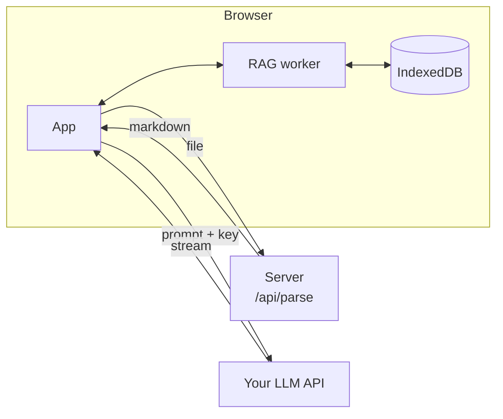
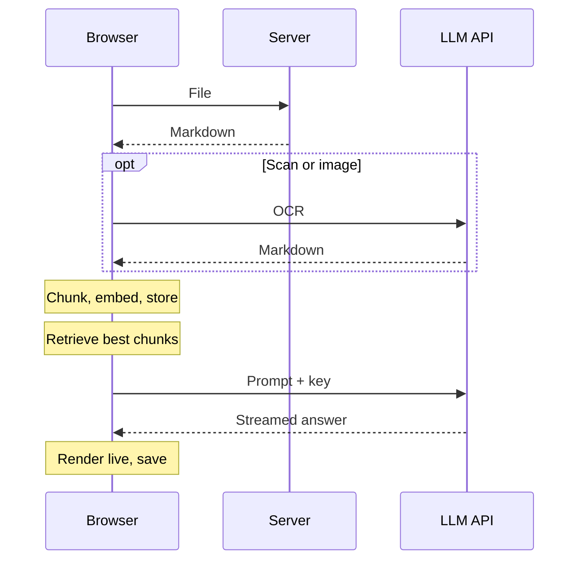
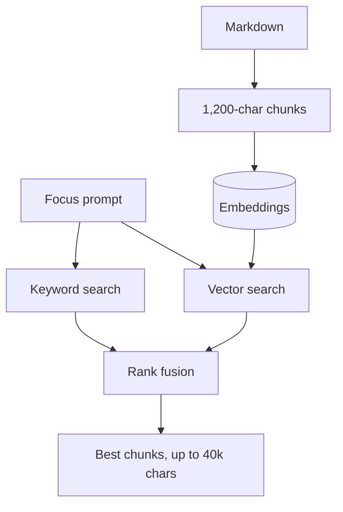
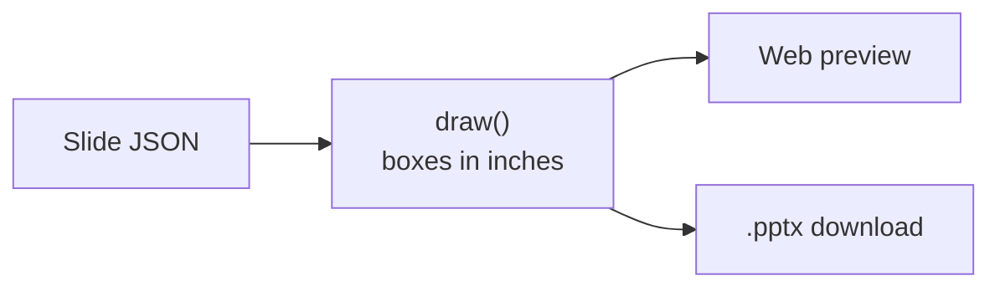

# ArcEdu

ArcEdu turns your documents into study notes, quizzes and slide decks.

Retrieval runs locally in your browser. It needs no vector database, no account and no server storage. The browser calls your LLM directly, so your API key never reaches our server. The server only converts files to markdown.

## Features

- **Upload:** PDF, Word, PowerPoint, Excel, OpenDocument, RTF, EPUB, CSV, TXT, MD and images. Scanned pages and images go through LLM OCR.
- **Notes:** markdown with KaTeX math, mermaid diagrams, code and tables, in five styles and four lengths.
- **Quiz:** multiple choice with difficulty, a timer, explanations, streaks and a results summary.
- **Slides:** seven layouts and seven palettes. You can present fullscreen and download a native `.pptx` with speaker notes.
- **Sessions:** documents and everything generated from them are saved per session in IndexedDB.
- **Settings:** API URL, model and key for any OpenAI-compatible API, saved in localStorage.

## Architecture



The browser does almost everything. The server only turns files into markdown, and the LLM is called straight from the browser with your saved settings.

| Part | Where | Role |
| --- | --- | --- |
| `app/api/parse` | Server | Converts a file to markdown with [AnyDoc](https://github.com/firecrawl/anydoc). For scans it returns a flag so the browser runs OCR instead. |
| `lib/llm.ts` | Browser | Calls the chat completions API with the saved settings, and runs vision OCR. |
| `lib/prompts.ts` | Browser | Builds the system and user prompts for each format. |
| `lib/rag.worker.ts` | Worker | Chunks, embeds and searches documents. |
| `lib/db.ts` | Browser | IndexedDB stores: `sessions`, `documents`, `notes`, `slides`, `quizzes`. |
| `lib/slides.ts` | Browser | Slide layouts shared by the preview and the `.pptx` export. |
| `contexts/app.tsx` | Browser | Shared state, upload, generation and streaming. |

## How It Works



1. **Upload:** each file is converted to markdown on the server. TXT and MD pass through as they are, and scans and images are transcribed by LLM OCR in the browser. The markdown is saved to IndexedDB under the current session.
2. **Index:** the worker chunks and embeds the new documents in the background, and stores the vectors with each document.
3. **Retrieve:** when you generate, the worker picks the most relevant chunks, up to about 40k characters, and returns them in reading order.
4. **Generate:** `lib/prompts.ts` builds a prompt for the chosen format, and the browser streams the answer straight from your LLM.
5. **Render:** quizzes and slides stream one JSON object per line, so they appear as each line completes. Notes stream as markdown.

## Local RAG

Retrieval runs in a Web Worker, so the UI never blocks.



Documents are indexed once, in the background. At generation time, keyword and vector search each rank the chunks, rank fusion merges the two lists, and the winners go to the LLM in reading order.

- **Model:** [mdbr-leaf-ir](https://huggingface.co/MongoDB/mdbr-leaf-ir), int8 quantized, running on onnxruntime-web (WASM). Both are pinned to fixed versions and kept in the Cache API after the first download.
- **Tokenizer:** a BERT uncased WordPiece tokenizer written in about 25 lines, with a 512-token limit.
- **Embedding:** inputs are batched 16 at a time and sorted by length to cut padding. Output vectors are L2-normalised, so cosine similarity is just a dot product.
- **Hybrid search:** BM25 scores keywords (k1 1.2, b 0.75) and the embeddings score meaning. Reciprocal rank fusion merges the two rankings.
- **No focus prompt:** chunks are taken at an even spread across the material, so the whole document is covered.
- **Jobs:** the worker runs one job at a time, so a document is never indexed twice.

## Slides

The LLM returns one JSON object per slide, each with a `layout`: `title`, `bullets`, `columns`, `stats`, `steps`, `table` or `quote`. `draw()` in `lib/slides.ts` places every slide as boxes in inches on a 10 × 5.625 slide.



Both the web preview and the export draw from the same boxes, so the download matches what you see. pptxgenjs is loaded only when you click Download.

## Setup

```bash
bun install
bun run dev
```

Open **Settings** at the bottom of the sidebar and enter an API URL, model and key for any OpenAI-compatible API, such as `https://api.openai.com/v1` with `gpt-4.1-mini`. The provider must allow browser requests (CORS). Use a vision-capable model if you want OCR for scans and images.

| Command | Does |
| --- | --- |
| `bun run dev` | Starts the dev server (Turbopack). |
| `bun run build` | Builds for production. |
| `bun run lint` | Generates route types and runs the typecheck. |

## Stack

- **Framework:** Next.js 16 (App Router, Turbopack, Cache Components) and React 19.
- **UI:** Tailwind CSS 4, plus Base UI with shadcn styling.
- **Rendering:** marked, KaTeX and mermaid.
- **Parsing and export:** AnyDoc for parsing and pptxgenjs for slide export.
- **Retrieval:** onnxruntime-web with mdbr-leaf-ir.
